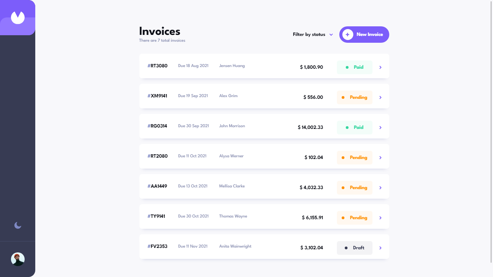

# Frontend Mentor - Invoice app solution

This is a solution to the [Invoice app challenge on Frontend Mentor](https://www.frontendmentor.io/challenges/invoice-app-i7KaLTQjl). Frontend Mentor challenges help you improve your coding skills by building realistic projects. 

## Table of contents

- [Overview](#overview)
  - [The challenge](#the-challenge)
  - [Screenshot](#screenshot)
  - [Links](#links)
- [My process](#my-process)
  - [Built with](#built-with)
  - [What I learned](#what-i-learned)
  - [Continued development](#continued-development)
  - [Useful resources](#useful-resources)
- [Author](#author)
- [Acknowledgments](#acknowledgments)

## Overview

### The challenge

Users should be able to:

- View the optimal layout for the app depending on their device's screen size
- See hover states for all interactive elements on the page
- Create, read, update, and delete invoices
- Receive form validations when trying to create/edit an invoice
- Save draft invoices, and mark pending invoices as paid
- Filter invoices by status (draft/pending/paid)
- Toggle light and dark mode
- **Bonus**: Keep track of any changes, even after refreshing the browser (`localStorage` could be used for this if you're not building out a full-stack app)

### Screenshot

### Links

- Solution URL: [GitHub Repo](https://github.com/ryanbradley-webdev/inventory-tracker)
- Live Site URL: [Hosted on Netlify](https://inventory-tracker-ryanbradley-webdev.netlify.app/)

## My process

### Built with

- [React](https://reactjs.org/)
- [React-Router](https://reactrouter.com/en/main)
- [Node.js](https://nodejs.org/en)
- [Express](https://expressjs.com/)
- [MongoDB](https://www.mongodb.com/)

### What I learned

This project was my first fully-hosted full-stack application with CRUD capability. Learning how to incorporate various hosting platforms' requirements (such as Google for the Node backend) proved to be a challenge, however overcoming these roadblocks provided plenty of learning opportunities.

### Continued development

In future projects I intend to further develop my form validation techniques, as well as developing custom hooks for form components that will autonomously handle validation, submission, errors and loading states.

## Author

- Website - [Ryan Bradley](https://www.ryanbradleyportfolio.com)
- Frontend Mentor - [@ryanbradley-webdev](https://www.frontendmentor.io/profile/ryanbradley-webdev)
- Instagram - [@ryanbradley_web_dev](https://www.instagram.com/ryanbradley_web_dev/)

## Acknowledgments

This project would not have been possible without the support of the Stack Overflow community for finding and solving several issues that I ran into along the way.

Additional libraries I used which drastically helped me develop this application:

- [axios](https://axios-http.com/docs/intro)
- [mongoose](https://mongoosejs.com/docs/)
